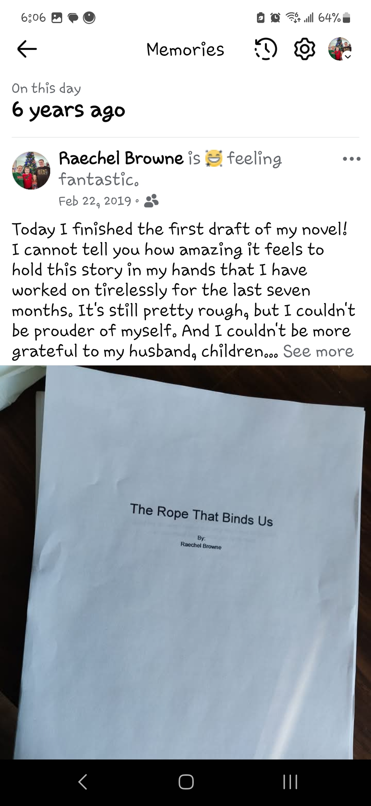
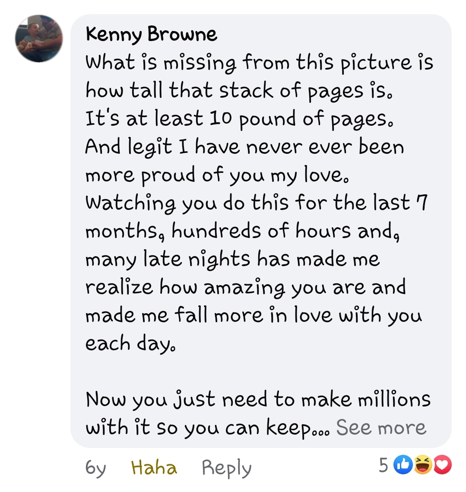
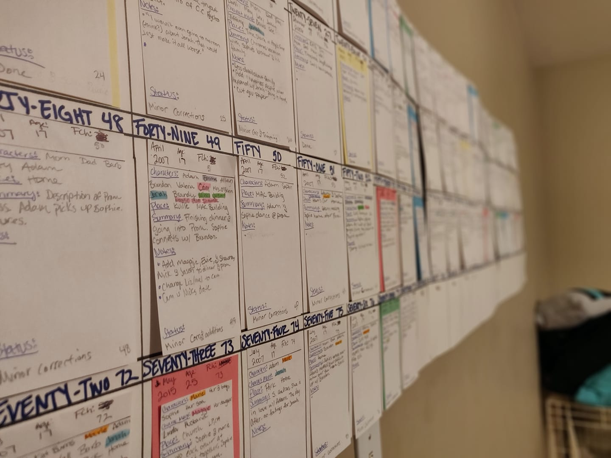
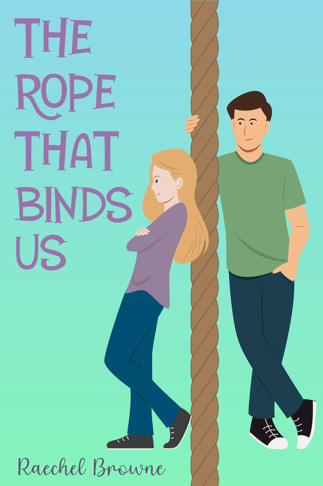

Saturday marked a great occasion that, up until that day, I was unaware of. I’m usually a whiz when it comes to dates, birthdays and anniversaries, but this date was not even on my radar until Facebook memories set me straight. Thank goodness for memories.

Six years ago on Saturday, I finished writing the first draft of The Rope That Binds Us! How crazy is that?!

I don’t know if you remember (or read) two posts ago, but I was trying to remember how long ago it was that I began writing this book. Well now we have our answer!!

I barely remember this day other than printing out the ridiculous amount of pages (242!). My printer kept getting jammed and running out of ink.

I shared my accomplishment on Facebook (obviously) and my husband left me the sweetest comment:

\*Swoon\*

I can’t tell you how incredibly different this first draft is compared to the final copy that is now available for purchase on Amazon and Barnes & Noble 😉. 

Now it sits on my bookshelf, unbound in a ratty manila envelope from my son’s school, pink ink littering the pages as I made corrections and adjustments. In the back is the timeline I wrote out to keep everything straight. 

Author tip: When you are bouncing around timelines, it helps to write it all out.

Once I did that, then I went psycho-organizer and wrote out chapter synopsisis? Synopsisi? Synopsies? IDK. I wrote out a synopsis for each chapter on 3x5 cards. Better?

Then I color coded them and highlighted certain characters in certain colors. I used poster putty so I could move chapters around at my whim. It made the organizer in me happy. And it gave me an overall bigger picture view.

It is so crazy to me how far I have come in six years. From finishing the first draft of a story I was pretty sure no one was going to read, to a published novel I can be proud of. Yay for dreams coming true.

Until Next Time,

RaeB